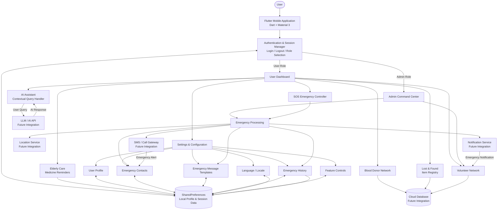
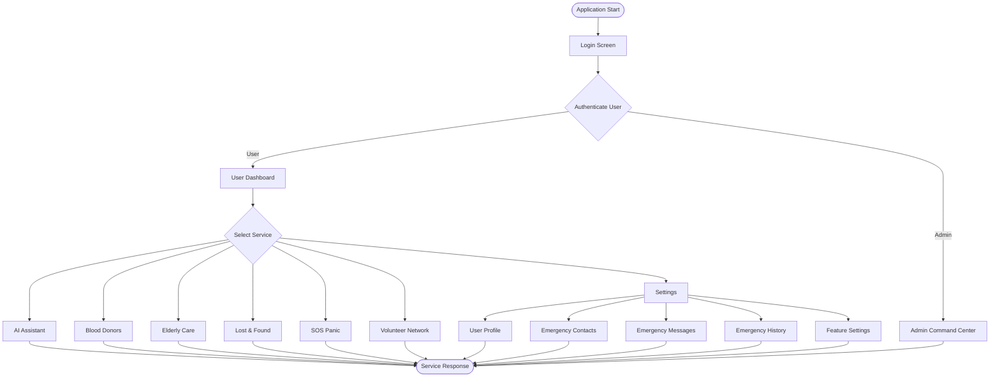

# 🆘 HelpHub AI

### AI-Powered Community Emergency Assistance & Safety Platform

HelpHub AI is a Flutter-based community assistance and emergency-support application designed to provide users with quick access to essential safety, healthcare, emergency, and community-support services through a single mobile platform.

The application combines **AI-assisted support, blood donor coordination, elderly care, lost-and-found management, SOS emergency assistance, volunteer coordination, emergency contacts, and incident history** into one centralized platform.

---

## 📌 Project Overview

In emergency situations, people often need to access multiple services such as emergency contacts, blood donors, volunteers, location assistance, and healthcare support.

HelpHub AI aims to provide these services through a single, easy-to-use mobile application.

The application provides two main roles:

* 👤 **User**
* 🛡️ **Administrator**

Users can access community and emergency-support services, while administrators can monitor system-level information and emergency-related activities.

---

# 🏗️ System Architecture

The following architecture represents the complete HelpHub AI system, including the current Flutter implementation and planned backend integrations.



---

# 🔄 System Workflow



---

# 🧩 Main Modules

## 🔐 1. Authentication Module

The authentication module provides role-based access to the application.

Two roles are currently supported:

### User

```text
Username: user
Password: 123
```

### Administrator

```text
Username: admin
Password: 123
```

The authenticated role is stored locally using `SharedPreferences`.

> These credentials are currently part of the prototype implementation and should be replaced with secure authentication before production deployment.

---

# 👤 2. User Dashboard

After successful user authentication, the application displays the **HelpHub User Hub**.

The dashboard provides access to:

* 🧠 AI Assistant
* 🩸 Blood Donors
* 👵 Elderly Care
* 🔎 Lost & Found
* 🚨 SOS Panic
* 🤝 Volunteers
* ⚙️ Settings

The features are presented using a responsive grid-based interface.

---

# 🧠 3. AI Assistant

The AI Assistant provides a conversational interface between the user and the HelpHub system.

### Current capabilities

The current prototype recognizes queries related to:

* Blood donors
* Elderly care
* Medicine
* SOS
* Dangerous situations
* General assistance

### Chat features

* User message input
* AI response display
* Conversation history during the session
* Automatic scrolling
* Send button
* Context-based responses

### Future Enhancement

The module can be connected to:

```text
User Query
     ↓
Backend API
     ↓
LLM / AI Model
     ↓
Context Processing
     ↓
AI Response
     ↓
Flutter Chat Interface
```

---

# 🩸 4. Blood Donor Network

The Blood Donor Network allows users to search registered blood donors.

### Features

* Donor listing
* Blood group information
* Donor availability
* Phone number
* Blood group filtering

### Supported blood groups

```text
A+
A-
B+
B-
AB+
AB-
O+
O-
```

### Future Enhancement

The module can be extended with:

* GPS-based donor discovery
* Real-time donor availability
* Blood compatibility matching
* Blood bank integration
* Emergency donor notifications

---

# 👵 5. Elderly Care Hub

The Elderly Care module helps users manage medication reminders.

### Features

* Medicine list
* Scheduled medication time
* Medication completion status
* Checkbox-based tracking
* Daily medication monitoring

Example:

```text
Aspirin Cardio
08:00 AM
Status: Taken

Metformin HCl
01:30 PM
Status: Pending

Multivitamin Complex
09:00 PM
Status: Pending
```

### Future Enhancement

* Local notifications
* Medication alarms
* Caregiver notifications
* Prescription management
* Doctor/caregiver dashboard

---

# 🔎 6. Lost & Found Board

The Lost & Found module provides a centralized board for reporting and viewing lost or found items.

### Information displayed

* Item name
* Item status
* Location
* Date

Example:

```text
Black Leather Wallet
Status: Lost
Location: Central Park Metro Station

Keys with Red Fob
Status: Found
Location: Library Cafeteria
```

### Future Enhancement

* Image upload
* Location tagging
* Search functionality
* Item matching
* Notifications
* Cloud database synchronization

---

# 🚨 7. SOS Panic System

The SOS module provides a dedicated emergency trigger.

The current prototype provides a large SOS button for quick access.

### Planned emergency workflow

```text
                 SOS Button
                     │
                     ▼
             Emergency Trigger
                     │
                     ▼
              Get User Location
                     │
                     ▼
            Retrieve SOS Contacts
                     │
                     ▼
             Prepare Alert Message
                     │
            ┌────────┴────────┐
            ▼                 ▼
        SMS / Call        Notification
            │                 │
            └────────┬────────┘
                     ▼
             Save Incident
                     │
                     ▼
             Emergency History
```

### Future integrations

* GPS location
* Emergency SMS
* Emergency calling
* Live location sharing
* Push notifications
* Nearby volunteer alerts
* Emergency service integration

---

# 🤝 8. Volunteer Network

The Volunteer Network module provides community-support missions.

Each mission contains:

* Mission area
* Distance
* Urgency
* Deployment option

Example:

```text
Sector 4 Emergency Relief Food Drive
Distance: 1.2 km
Urgency: High

First Aid Support Station
Distance: 3.4 km
Urgency: Medium
```

Users can select **Deploy** to participate in a mission.

### Future Enhancement

* Volunteer registration
* Real-time volunteer location
* Mission assignment
* Emergency dispatch
* Volunteer availability status
* Admin-controlled deployment

---

# ⚙️ Settings & Configuration

The Settings module provides centralized application configuration.

```text
Settings
│
├── 👤 User Profile
│
├── 🌐 Language / Locale
│
├── 📞 Emergency Contacts
│
├── 💬 Emergency Messages
│
├── 📋 Emergency History
│
└── ⚙️ Feature Controls
```

---

# 👤 User Profile

Users can manage their personal information.

### Current fields

* Full Name
* Primary Phone Number
* Blood Group
* Critical Medical Conditions

The current implementation stores profile information locally using `SharedPreferences`.

---

# 📞 Emergency Contacts

Users can manage trusted contacts for emergency situations.

### Features

* Add contact
* Contact name
* Relationship
* Phone number
* Delete contact

Example:

```text
Name          Relationship       Phone
---------------------------------------------
Mom           Mother             +1 987 654 3210
Alex Smith    Friend             +1 555 019 2834
```

### Future Enhancement

Emergency contacts can be synchronized with the backend and automatically used during SOS events.

---

# 💬 Emergency Messages

The Emergency Messages module allows users to customize their emergency message template.

Example:

```text
EMERGENCY!

I need immediate help.
HelpHub AI has registered my distress.
My location details will follow shortly.
```

The message can be customized by the user.

---

# 📋 Emergency History

The Emergency History module maintains a record of emergency events.

Each record contains:

* Incident type
* Dispatch status
* Date
* Time

Example:

```text
Panic Shake Alert
Status: Dispatched to 2 Contacts
Date: June 08, 2026
Time: 22:14
```

---

# 🌐 Language / Locale

The application currently provides language selection options:

* 🇬🇧 English
* 🇪🇸 Spanish
* 🇮🇳 Hindi

Future versions can add additional Indian and regional languages.

---

# ⚙️ Feature Controls

Users can configure safety-related application features.

### Available controls

* Shake Phone to SOS
* AI Voice Wake Word Activation
* Persistent Background Tracking

These controls provide the foundation for future hardware and background-service integrations.

---

# 🛡️ Admin Command Center

The application provides a separate administrator dashboard.

The Admin Command Center displays system-level information such as:

### 🚨 Active Emergency Triggers

Displays active emergency signals.

### 🤝 Volunteer Network Nodes

Displays volunteer network information.

### 🗄️ Global Registry Metrics

Displays database/system status information.

### 📡 Broadcast Gateway Logs

Displays emergency broadcast pipeline information.

The admin interface can be extended into a complete emergency-management dashboard.

---

# 🗂️ Project Structure

```text
helphub_ai/
│
├── android/
│
├── ios/
│
├── lib/
│   │
│   ├── main.dart
│   │
│   ├── screens/
│   │   │
│   │   ├── login_screen.dart
│   │   ├── user_home_screen.dart
│   │   ├── admin_home_screen.dart
│   │   │
│   │   ├── ai_assistant_screen.dart
│   │   ├── blood_screen.dart
│   │   ├── elderly_screen.dart
│   │   ├── lost_found_screen.dart
│   │   ├── sos_screen.dart
│   │   ├── volunteer_screen.dart
│   │   │
│   │   └── settings/
│   │       │
│   │       ├── settings_screen.dart
│   │       ├── profile_screen.dart
│   │       ├── emergency_contacts_screen.dart
│   │       ├── emergency_messages_screen.dart
│   │       ├── emergency_history_screen.dart
│   │       ├── language_screen.dart
│   │       └── features_settings_screen.dart
│   │
│   └── widgets/
│       └── feature_card.dart
│
├── assets/
│
├── test/
│
├── pubspec.yaml
│
└── README.md
```

---

# 🧰 Technology Stack

| Technology        | Purpose                              |
| ----------------- | ------------------------------------ |
| Flutter           | Mobile application development       |
| Dart              | Programming language                 |
| Material 3        | User interface                       |
| SharedPreferences | Local storage and session management |
| Android           | Mobile deployment                    |
| Git               | Version control                      |
| GitHub            | Source-code hosting                  |

---

# 🔌 Planned Technology Integrations

The following technologies can be integrated in future versions:

| Technology              | Purpose                        |
| ----------------------- | ------------------------------ |
| Firebase Authentication | Secure authentication          |
| Firebase Firestore      | Cloud database                 |
| Firebase Storage        | Image/file storage             |
| Gemini / Groq / LLM API | Real AI assistant              |
| Google Maps             | Location and emergency mapping |
| GPS                     | Real-time location             |
| SMS API                 | Emergency messages             |
| Push Notifications      | Emergency alerts               |
| Background Services     | Continuous safety monitoring   |

---

# 🔐 Security

Security is an important part of an emergency-support platform.

For production deployment, the following measures should be implemented:

* Secure authentication
* Password hashing
* Role-based authorization
* HTTPS communication
* API key protection
* Database security rules
* Encrypted sensitive information
* Secure storage of emergency contacts
* Protection of medical information
* Secure location-data handling
* Audit logging

The current username/password implementation is only intended for prototype/demo purposes.

---

# 🧪 Testing

The following test cases should be performed before deployment.

| Module       | Test Case                     | Expected Result                   |
| ------------ | ----------------------------- | --------------------------------- |
| Login        | Enter valid user credentials  | User dashboard opens              |
| Login        | Enter valid admin credentials | Admin dashboard opens             |
| Login        | Enter invalid credentials     | Error message displayed           |
| AI Assistant | Send message                  | Response displayed                |
| Blood Donors | Select blood group            | Matching donors displayed         |
| Elderly Care | Mark medicine                 | Status changes                    |
| Lost & Found | Add item                      | New item appears                  |
| SOS          | Press SOS                     | Emergency notification displayed  |
| Volunteers   | Select Deploy                 | Deployment confirmation displayed |
| Profile      | Save profile                  | Profile data saved                |
| Contacts     | Add contact                   | Contact appears                   |
| Contacts     | Delete contact                | Contact removed                   |
| Messages     | Update template               | Confirmation displayed            |
| History      | Open history                  | Previous incidents displayed      |
| Language     | Select language               | Language selection changes        |
| Features     | Toggle feature                | Feature state changes             |

---

# 📱 Application Screens

The current application contains the following major screens:

```text
                     HelpHub AI
                         │
                         ▼
                    Login Screen
                         │
             ┌───────────┴───────────┐
             │                       │
             ▼                       ▼
        User Dashboard          Admin Dashboard
             │
             ▼
      ┌──────┼──────┬────────┬────────┬────────┐
      │      │      │        │        │        │
      ▼      ▼      ▼        ▼        ▼        ▼
     AI    Blood  Elderly  Lost &    SOS    Volunteer
Assistant Donors   Care    Found    Panic    Network
      │
      ▼
   Settings
      │
 ┌────┼──────────┬──────────┬─────────┐
 ▼    ▼          ▼          ▼         ▼
Profile Contacts Messages History  Features
```

---

# 🎯 Project Objectives

The primary objectives of HelpHub AI are:

1. Provide a centralized community assistance platform.
2. Provide quick access to emergency-support services.
3. Provide AI-assisted user interaction.
4. Connect users with blood donors.
5. Support elderly medication management.
6. Facilitate lost-and-found coordination.
7. Connect volunteers with community missions.
8. Manage emergency contacts.
9. Maintain emergency incident history.
10. Provide an administrator monitoring interface.
11. Provide a foundation for real-time emergency communication.
12. Improve accessibility to community-support resources.

---

# 🌍 Social Impact

HelpHub AI is designed to support communities by bringing multiple assistance services into a single mobile application.

Potential areas of social impact include:

* 🚨 Emergency response
* 🩸 Blood donation coordination
* 👵 Elderly assistance
* 🤝 Community volunteering
* 🔎 Lost-and-found recovery
* 📍 Location-based emergency support
* 📱 Emergency communication
* 🤖 AI-assisted guidance

---

# 🔮 Future Scope

The project can be expanded into a complete real-time community emergency platform.

### 1. Real-Time AI

```text
User
 ↓
AI Assistant
 ↓
Backend API
 ↓
LLM
 ↓
Context Processing
 ↓
Emergency / Community Response
```

### 2. Real-Time SOS

```text
SOS Trigger
 ↓
GPS Location
 ↓
Emergency Contacts
 ↓
SMS / Call
 ↓
Volunteer Network
 ↓
Emergency Services
```

### 3. Cloud Infrastructure

```text
Flutter App
     ↓
REST API
     ↓
Authentication
     ↓
Cloud Database
     ↓
Notification Service
```

### 4. Smart Emergency Matching

The system can automatically match users with:

* Nearby blood donors
* Nearby volunteers
* Hospitals
* Blood banks
* Emergency services
* Available caregivers

---

# 📊 Current Implementation Status

| Component               | Status        |
| ----------------------- | ------------- |
| Flutter UI              | ✅ Implemented |
| User Login              | ✅ Implemented |
| Admin Login             | ✅ Implemented |
| Role-Based Navigation   | ✅ Implemented |
| User Dashboard          | ✅ Implemented |
| Admin Dashboard         | ✅ Implemented |
| AI Assistant UI         | ✅ Implemented |
| Contextual AI Responses | ✅ Prototype   |
| Blood Donor Module      | ✅ Implemented |
| Elderly Care Module     | ✅ Implemented |
| Lost & Found            | ✅ Implemented |
| SOS Interface           | ✅ Implemented |
| Volunteer Module        | ✅ Implemented |
| User Profile            | ✅ Implemented |
| Emergency Contacts      | ✅ Implemented |
| Emergency Messages      | ✅ Implemented |
| Emergency History       | ✅ Implemented |
| Language Selection      | ✅ Implemented |
| Feature Controls        | ✅ Implemented |
| Local Session Storage   | ✅ Implemented |
| Cloud Database          | 🔄 Future     |
| Secure Authentication   | 🔄 Future     |
| Real LLM Integration    | 🔄 Future     |
| GPS Integration         | 🔄 Future     |
| Real SMS/Calling        | 🔄 Future     |
| Push Notifications      | 🔄 Future     |
| Live Emergency Map      | 🔄 Future     |

---

# 🚀 Installation & Setup

## Prerequisites

Install:

* Flutter SDK
* Dart SDK
* Android Studio
* Android SDK
* Git

Verify Flutter:

```bash
flutter doctor
```

---

## Clone Repository

```bash
git clone <YOUR_GITHUB_REPOSITORY_URL>
```

Navigate to the project:

```bash
cd helphub_ai
```

---

## Install Dependencies

```bash
flutter pub get
```

---

## Run the Application

Connect an Android device or start an emulator.

```bash
flutter run
```

---

# 📦 Build APK

To generate a release APK:

```bash
flutter build apk --release
```

The generated APK will normally be located at:

```text
build/app/outputs/flutter-apk/app-release.apk
```

---

# 🔑 Demo Credentials

## User

```text
Username: user
Password: 123
```

## Admin

```text
Username: admin
Password: 123
```

> ⚠️ These are prototype credentials only. Production applications should use secure authentication.

---

# 📸 Screenshots

Add your application screenshots to a `screenshots` folder:

```text
screenshots/
├── login.png
├── user_dashboard.png
├── admin_dashboard.png
├── ai_assistant.png
├── blood_donors.png
├── elderly_care.png
├── lost_found.png
├── sos.png
├── volunteers.png
└── settings.png
```

Then display them in the README using:

```markdown
## 📸 Screenshots

### Login


### User Dashboard


### AI Assistant


### Blood Donors


### Elderly Care


### Lost & Found


### SOS


### Volunteers


### Settings


```

---

# 📁 Recommended GitHub Repository Structure

```text
HelpHub-AI/
│
├── android/
├── ios/
├── lib/
├── assets/
├── screenshots/
│
├── test/
│
├── pubspec.yaml
├── analysis_options.yaml
├── .gitignore
└── README.md
```

---

# 👩‍💻 Project Team

## HelpHub AI

**AI-Powered Community Emergency Assistance & Safety Platform**

Developed using:

```text
Flutter
Dart
Material 3
SharedPreferences
```

---

# 📜 License

This project is developed for **educational, academic, and prototype purposes**.

---

# ⭐ Acknowledgement

HelpHub AI was developed with the goal of exploring how mobile technology, artificial intelligence, emergency communication, and community participation can be combined to create a centralized assistance platform.

---

## 🆘 HelpHub AI

### Connect • Assist • Protect

> **One platform for community assistance, emergency support, and safer communities.**
